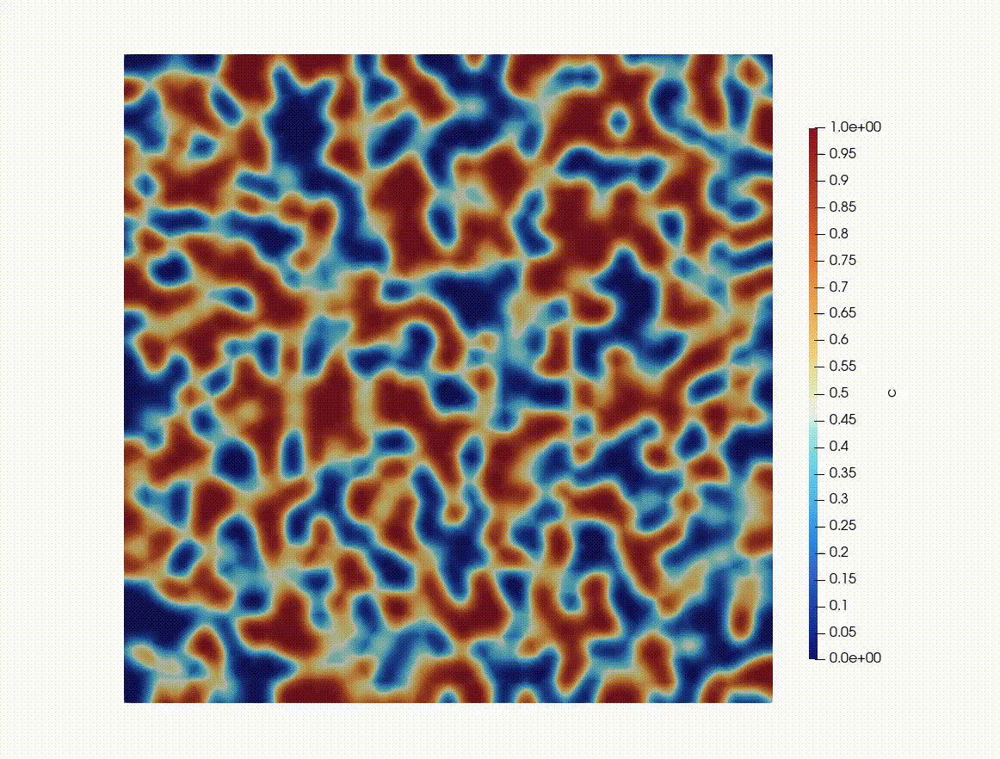

# Cahn–Hilliard DG Solver

Solves the Cahn–Hilliard equation using a discontinuous Galerkin (DG) method with adaptive mesh refinement, implemented in [NGSolve](https://ngsolve.org).

---

## Equations

The Cahn–Hilliard equation describes phase separation of a binary mixture. The phase field $c \in [0,1]$ and chemical potential $\mu$ satisfy:

$$\frac{\partial c}{\partial t} + \nabla \cdot (-M \nabla \mu) = 0$$

$$\mu = \frac{dF}{dc} - \lambda \nabla^2 c$$

where the bulk free energy density is the double-well potential:

$$F(c) = 100\, c^2 (1 - c)^2$$

giving:

$$\frac{dF}{dc} = 200\, c\,(1 - c)\,(1 - 2c)$$

---

## Method

- **Spatial discretisation:** Interior Penalty DG
- **Time integration:** Implicit Euler with Newton iteration
- **AMR:** Zienkiewicz–Zhu gradient-recovery error estimator on $\nabla c$

---

## Requirements

- Python 3.9+
- [NGSolve](https://ngsolve.org) (includes Netgen and its GUI)
- NumPy

```bash
pip install -r requirements.txt
```

---

## Running

```bash
python ch.py
```
To view results in ParaView, bundle the snapshots into a time series:

```bash
python vtu_post_processor.py
```

which creates `cahnhilliard.pvd`.

### Files

| File | Purpose |
|---|---|
| `ch.py` | Main script: mesh, time loop, GUI |
| `user_settings.py` | Simulation parameters |
| `weakform.py` | DG weak form of the CH equations |
| `solver.py` | Newton iteration (and an optional bound limiter) |
| `ic_bc.py` | Random per-element binary initial condition (seeded) |
| `amr.py` | ZZ error estimator, mesh refinement, VTK output |
| `helpers.py` | DG jump/average operators |
| `vtu_post_processor.py` | Collects VTU snapshots into a `.pvd` for ParaView |

---

## Sample Output


